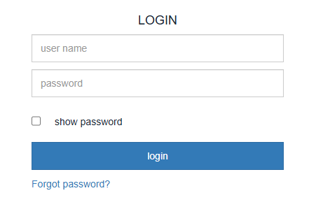
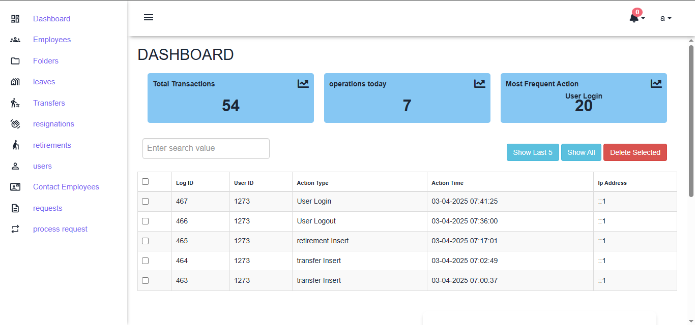
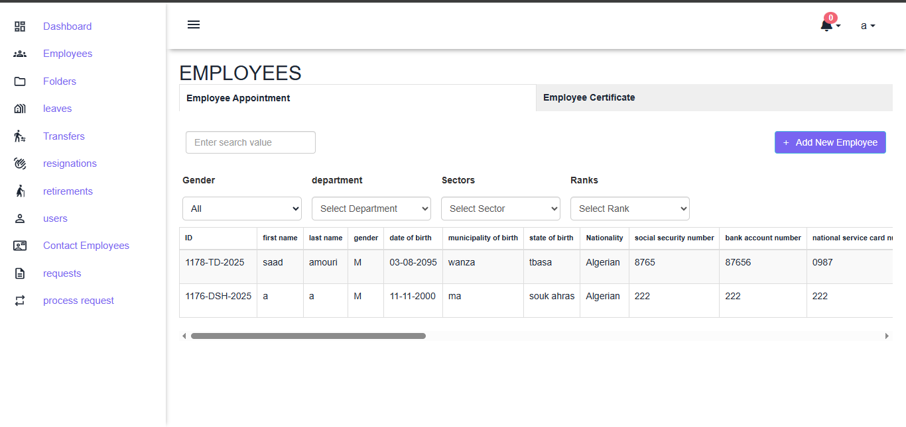
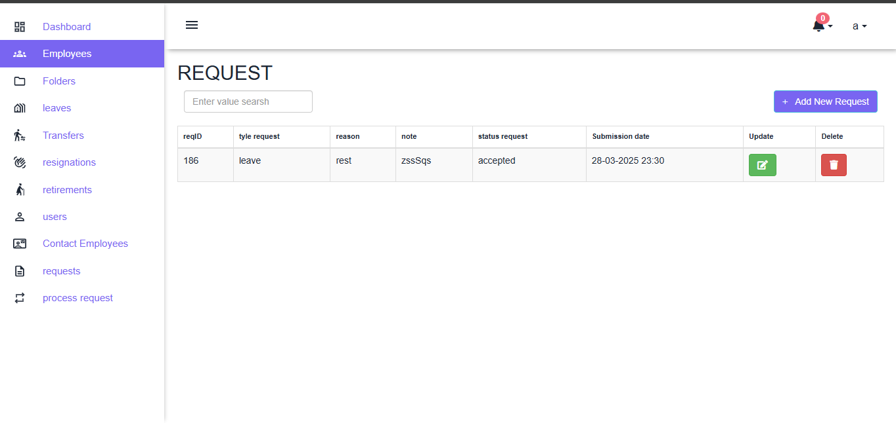
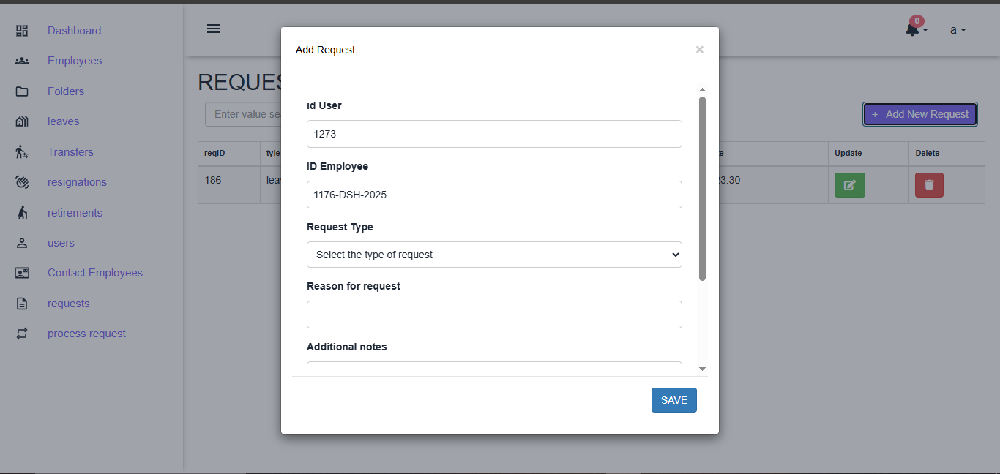
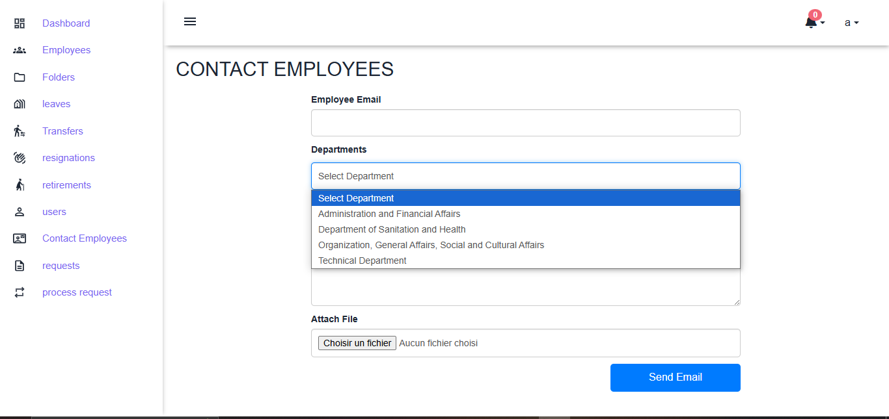

# Employee Management System

**Employee Management System** is a comprehensive web application designed to streamline and modernize human resources operations within an organization.

The system provides a wide range of core and advanced functionalities, including:

- Managing employee data (add, edit, delete).
- Automatically storing documents through an integrated Document Management System (DMS).
- Tracking employee leaves and department transfers within the organization.
- Managing resignations and retirements efficiently.
- Creating new user accounts with role-based access control (RBAC).
- Communicating with employees via email.
- Automatically submitting requests from employees to the administration, with support for automated processing.
- An interactive dashboard to monitor system activities and analyze performance.

This system aims to provide a professional digital environment that enhances the efficiency and speed of HR operations while improving the overall employee management experience.

## Technologies Used

- **Frontend**: HTML, CSS, JavaScript
- **framework**: Bootstrap, FontAwesome
- **Backend**: PHP (with OCI8)
- **Database**: Oracle Database
- **Email Integration**: PHP Mail / SMTP

## System Preview

### Login page

### Dashbord page

### Employees page

### Requests page

### Add request

### Contact employees

### Folders_page

